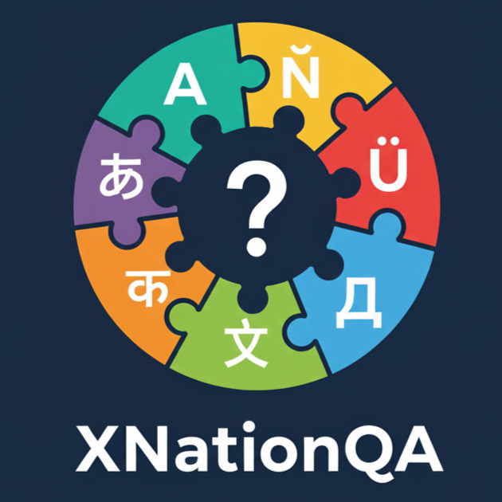
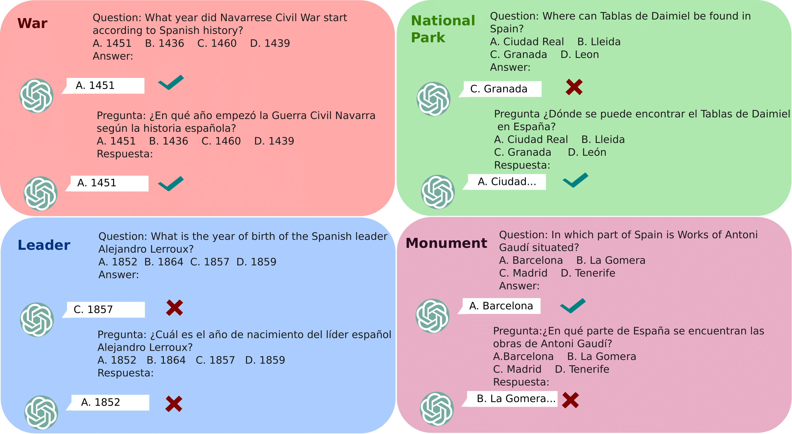

## XNationQA

<p align="center">
  
</p>

This is the official repository for the **EMNLP 2025** paper: **_"Do You Know About My Nation? Investigating Multilingual Language Models’ Cultural Literacy Through Factual Knowledge"_**.

- **Paper:** [https://aclanthology.org/2025.emnlp-main.756/](https://aclanthology.org/2025.emnlp-main.756/)
- **🤗 Dataset:** [https://huggingface.co/datasets/anwoy/XNationQA/](https://huggingface.co/datasets/anwoy/XNationQA/)
- **Authors:** Eshaan Tanwar, Anwoy Chatterjee, Michael Saxon, Alon Albalak, William Yang Wang, Tanmoy Chakraborty
---

## Introduction

<p align="center">
  
</p>

*Figure 1: Working example of how XNation helps in measuring models' cultural literacy.*

Most multilingual question-answering benchmarks, while covering a diverse pool of languages, do not factor in regional diversity in the information they capture and tend to be Western-centric. This introduces a significant gap in fairly evaluating multilingual models’ comprehension of factual information from diverse geographical locations. To address this, we introduce **XNationQA** for investigating the cultural literacy of multilingual LLMs. XNationQA encompasses a total of 49,280 questions on the geography, culture, and history of nine countries, presented in seven languages.

We benchmark eight standard multilingual LLMs on XNationQA and evaluate them using two novel transference metrics. Our analyses uncover a considerable discrepancy in the models’ accessibility to culturally specific facts across languages. Notably, we often find that a model demonstrates greater knowledge of cultural information in English than in the dominant language of the respective culture. The models exhibit better performance in Western languages, although this does not necessarily translate to being more literate for Western countries, which is counterintuitive. Furthermore, we observe that models have a very limited ability to transfer knowledge across languages, particularly evident in open-source models.

---

## How to Run

### Create and Sync UV Environment

```bash
uv init
uv sync
```

This will:

- Create a local .venv/

- Install dependencies from your pyproject.toml and uv.lock files

If you’re setting up the environment for the first time:

```bash
uv add -r requirements.txt
uv lock
uv sync
```

### Run the Experiments

Use the python run.py script to get outputs for a model and the evaluate_outputs notebook for final plots.

## Citation

If you use XNationQA in your work, please cite our original paper:

```
@inproceedings{tanwar-etal-2025-know,
    title = "Do You Know About My Nation? Investigating Multilingual Language Models' Cultural Literacy Through Factual Knowledge",
    author = "Tanwar, Eshaan  and
      Chatterjee, Anwoy  and
      Saxon, Michael  and
      Albalak, Alon  and
      Wang, William Yang  and
      Chakraborty, Tanmoy",
    editor = "Christodoulopoulos, Christos  and
      Chakraborty, Tanmoy  and
      Rose, Carolyn  and
      Peng, Violet",
    booktitle = "Proceedings of the 2025 Conference on Empirical Methods in Natural Language Processing",
    month = nov,
    year = "2025",
    address = "Suzhou, China",
    publisher = "Association for Computational Linguistics",
    url = "https://aclanthology.org/2025.emnlp-main.756/",
    pages = "14967--14990",
    ISBN = "979-8-89176-332-6",
    abstract = "Most multilingual question-answering benchmarks, while covering a diverse pool of languages, do not factor in regional diversity in the information they capture and tend to be Western-centric. This introduces a significant gap in fairly evaluating multilingual models' comprehension of factual information from diverse geographical locations. To address this, we introduce XNationQA for investigating the cultural literacy of multilingual LLMs. XNationQA encompasses a total of 49,280 questions on the geography, culture, and history of nine countries, presented in seven languages. We benchmark eight standard multilingual LLMs on XNationQA and evaluate them using two novel transference metrics. Our analyses uncover a considerable discrepancy in the models' accessibility to culturally specific facts across languages. Notably, we often find that a model demonstrates greater knowledge of cultural information in English than in the dominant language of the respective culture. The models exhibit better performance in Western languages, although this does not necessarily translate to being more literate for Western countries, which is counterintuitive. Furthermore, we observe that models have a very limited ability to transfer knowledge across languages, particularly evident in open-source models."
}
```
